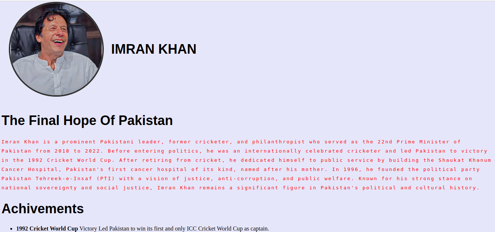

🎗️ Imran Khan Tribute Website
A tribute website dedicated to Imran Khan — the former Prime Minister of Pakistan, legendary cricketer, philanthropist, and visionary leader. This responsive webpage highlights his life, achievements, and legacy using HTML and CSS.

🔧 Tech Stack:
HTML5

CSS3 (Flexbox for layout)

🌟 Features:
A hero section with a profile image and name

Biography paragraph with stylized typography

List of major achievements

External link to Imran Khan's Wikipedia page

📷 Preview:
A clean and minimal tribute page with a light purple theme and centered content layout.

